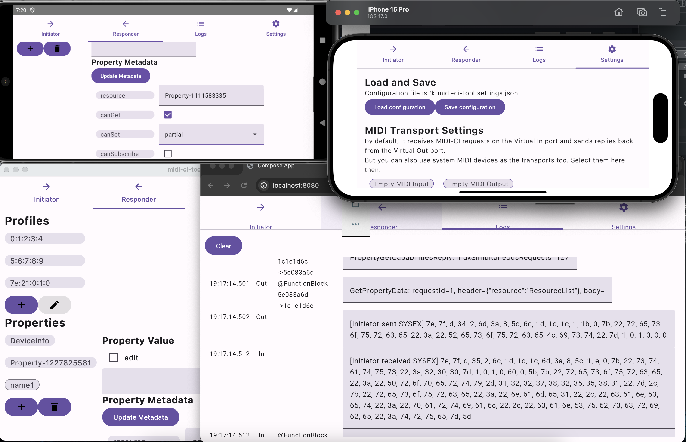

# ktmidi: Kotlin Multiplatform library for MIDI 1.0 and MIDI 2.0


ktmidi is a Kotlin Multiplatform library for MIDI Access API and MIDI data processing that covers MIDI 1.0 and MIDI 2.0.



## Features

It provides various MIDI features, including implementations for MIDI 1.0, Standard MIDI File Format, MIDI 2.0 UMP, MIDI-CI and related specifications.

In `ktmidi` module:

- MIDI 1.0 bytestream messages and 2.0 UMPs everywhere.
- `MidiAccess` : MIDI access abstraction API like what Web MIDI API 1.0 provides.
  - It also supports MIDI 2.0 UMP ports since v0.8.0, if the underlying API supports them. Currently Android 15 (preview API) is supported.
  - There are actual implementations for some platform specific MIDI API within this library, and you can implement your own backend if you need.
  - Unlike `javax.sound.midi` API, this API also covers creating virtual ports wherever possible.
    - `ktmidi-jvm-desktop` module contains ALSA backend (`AlsaMidiAccess`), as well as [RtMidi](https://github.com/thestk/rtmidi) backend (`RtMidiAccess`) via [atsushieno/rtmidi-javacpp](https://github.com/atsushieno/rtmidi-javacpp) for Linux and MacOS 
      - Windows needs JavaCPP build improvements and left unsupported (it does not matter, WinMM does not support virtual ports either way)
    - `ktmidi-native-ext` module contains RtMidi *native* backend (`RtMidiNativeAccess`) for Kotlin-Native. `player-sample-native` sample app uses it.
  - For Kotlin/Native and Apple OSes (macOS, iOS, etc.) there are `UmpCoreMidiAccess` (supports access to MIDI 2.0 and 1.0 devices, only on newer OSes) and `TraditionalCoreMidiAccess` (supports access to MIDI 1.0 devices).
  - For Kotlin/JS, `JzzMidiAccess` which wraps [Jazz-Soft JZZ](https://jazz-soft.net/doc/JZZ/) is included in `ktmidi` module. It should cover both node.js and web browsers.
  - For Kotlin/Wasm on browsers, `WebMidiAccess` in `ktmidi` module makes use of Web MIDI API directly. (Node/Deno via wasmWasi is not covered yet.)
- `MidiMusic` and `Midi2Music` : represents Standard MIDI File format structure, with reader and writer. (MIDI 2.0 support only partially based on standard; `Midi2Track` follows MIDI Clip File specification but there is no multi-track comparable specification to SMF for MIDI 2.0 yet.)
  - No strongly-typed message types (something like NoteOnMessage, NoteOffMessage, and so on). There is no point of defining strongly-typed messages for each mere MIDI status byte - you wouldn't need message type abstraction.
    - No worries, there are constants of Int or Byte in `MidiChannelStatus`, `MidiCC`, `MidiRpn`, `MidiMetaType` etc. so that you don't have to remember the actual constant numbers.
  - `MidiMusic.read()` reads and `MidiMusic.write()` writes to SMF (standard MIDI format) files with MIDI messages, with `Midi1TrackMerger`, `Midi2TrackMerger`, `Midi1TrackSplitter` and `Midi2TrackSplitter` that help you implement sequential event processing for your own MIDI players, or per-track editors if needed.
  - `UmpFactory` and `UmpRetriever` provides various accessors to MIDI 2.0 `Ump` data class.
  - `UmpTranslator` covers the standard conversion between MIDI 1.0 and MIDI 2.0 protocols, with a set of extensive options.
  - `Midi1Machine` and `Midi2Machine` work as a potential MIDI device internal state machine, which is also to cover MIDI-CI Process Inquiry "MIDI Message Report" feature.
- `MidiPlayer` and `Midi2Player`: provides MIDI player functionality: play/pause/stop and fast-forwarding.
  - Midi messages are sent to its "message listeners". If you don't pass a Midi Access instance or a Midi Output instance, it will do nothing but event dispatching.
  - It is based on customizible scheduler `MidiPlayerTimer`. You can pass a stub implementation that does not wait, for testing.
  - Not realtime strict (as on GC-ed language / VM), but would suffice for general usage.

In `ktmidi-ci` module (the overall API is unstable and subject to change):

- `MidiCIDevice` class implements MIDI-CI agent models that conforms to MIDI-CI, Common Rules for MIDI-CI Profile Inquiry, and Common Rules for MIDI-CI Property Exchange specifications.
- `Message` implements the sturecures for each MIDI-CI message type.
- primitive MIDI-CI SysEx byte stream processor in `CIFactory` and `CIRetrieval` classes.

See [MIDI-CI design doc](docs/design/MIDI-CI.md) for more details.

There are handful of sample project modules:

- `player-sample` is an example console MIDI player for Kotlin/JVM desktop.
- `player-sample-native` is almost the same, but for Kotlin/Native desktop.
- `input-sample` is an example console MIDI input receiver that dumps the MIDI messages it received, for Kotlin/JVM desktop.
- `ktmidi-ci-tool` is a comprehensive MIDI-CI functionality demo that connects to another MIDI-CI device (through a pair of MIDI connections so far).

## Using ktmidi

Here is an example code excerpt to set up platform MIDI device access, load an SMF from some file, and play it:

```
// for some complicated reason we don't have simple "default" MidiAccess API instance
val access = if(File("/dev/snd/seq").exists()) AlsaMidiAccess() else JvmMidiAccess()
val bytes = Files.readAllBytes(Path.of(fileName)).toList()
val music = MidiMusic()
music.read(bytes)
val player = MidiPlayer(music, access)
player.play()
```

To use ktmidi, add the following lines in the `dependencies` section in `build.gradle(.kts)`:

```
dependencies {
    implementation "dev.atsushieno:ktmidi:+" // replace + with the actual version
}
```

The actual artifact might be platform dependent like `dev.atsushieno:ktmidi-android:+` or `dev.atsushieno:ktmidi-js:+`, depending on the project targets.

If you want to bring better user experience on desktop (which @atsushieno recommends as `javax.sound.midi` on Linux is quite featureless), add `ktmidi-jvm-desktop` too,


```
plugins { // skip this if you are rather building a library (not an app)
    id("org.bytedeco.gradle-javacpp-platform") version "1.5.10"
}

dependencies {
    implementation "dev.atsushieno:ktmidi-jvm-desktop:+" // replace + with the actual version
}
```

... and use any of the following:

- Windows: `JvmMidiAccess`
- Linux: `AlsaMidiAccess`, `RtMidiAccess`, or `LibreMidiAccess`
- Mac: `LibreMidiAccess` or `RtMidiAccess`

For example, @atsushieno uses `if (File.exists("/dev/snd/seq")) AlsaMidiAccess() else if (System.getProperty("os.name").contains("Windows")) JvmMidiAccess() else LibreMidiAccess(MidiTransportProtocol.MIDI1)` (or `RtMidiAccess` instead of `LibreMidiAccess`) to create best `MidiAccess` instance.

**NOTE**: if you are building a desktop MIDI library using `ktmidi-jvm-desktop`, your *application* needs to add javacpp-platform Gradle plugin:

```
plugins {
    id("org.bytedeco.gradle-javacpp-platform") version "1.5.10"
}
```

and the following lines for `dependencies`:

```
dependencies {
    (...)
    api(libs.rtmidi.javacpp.platform)
    api(libs.libremidi.javacpp.platform)
}
```

The JavaCPP Platform Gradle plugin replaces the reference to `*.javacpp.platform` library with the actual platform-specific ones. (You should NOT do this in your *library* build, as it will result in that your library is useful only on the same platform as your building environment(!))

ktmidi is released at sonatype and hence available at Maven Central.

## Platform Access API

For platform MIDI access API, we cover the following APIs:

- `AndroidMidiAccess`: Android MIDI API (in Kotlin)
- `AlsaMidiAccess`: ALSA sequencer
- `RtMidiAccess`: RtMidi (which covers Windows, Mac, Linux, and iOS, but iOS is in general excluded in JVM solution. Note that [rtmidi-javacpp](https://github.com/atsushieno/rtmidi-javacpp) contains prebuilt binaries only for those x86_64 desktop targets. For other platforms, **you are supposed to set up rtmidi 5.0.x locally.**.
- `RtMidiNativeAccess`: RtMidi access for Kotln/Native implementation. Note tha there is [a static linking issue](https://github.com/atsushieno/ktmidi/issues/39) to be resolved.
- `UmpCoreMidiAccess`: Apple CoreMIDI API on Kotlin/Native. MIDI 2.0 or 1.0, but only on [newer OSes](https://developer.apple.com/documentation/coremidi/3566488-midiinputportcreatewithprotocol).
- `TraditionalCoreMidiAccess`: Apple CoreMIDI API on Kotlin/Native. MIDI 1.0 only.
- `JvmMidiAccess`: javax.sound.midi API (with limited feature set).
- `WebMidiAccess` : Web MIDI API for Kotlin/Wasm target (browser only).
- `JzzMidiAccess` : Web MIDI API for Kotlin/JS target (browser and nodejs, experimental, untested).

For dependency resolution reason, ALSA implementation and RtMidi implementation are split from `ktmidi-jvm` and formed as `ktmidi-jvm-desktop`.

ktmidi builds for Kotlin/JVM, Kotlin/JS and Kotlin/Native (though I only develop with Kotlin/JVM and Kotlin/JS so far).

The entire API is still subject to change, and it had been actually radically changing when development was most active.

## MIDI 2.0 support

### Potential field of usages

ktmidi supports MIDI 2.0 UMPs, and MIDI-CI if you count it as part of MIDI 2.0.

UMPs It can be sent and received in our own manner (i.e. it presumes MIDI 2.0 protocol is already established elsewhere). There was a now-deprecated way to promote MIDI protocols using Protocol Negotiation and some apps like [atsushieno/kmmk](https://github.com/atsushieno/kmmk) made use of it (Protocol Negotiation is gone in MIDI-CI version 1.2 specification). Now that it is gone, you are supposed to establish UMP-enabled transports by your own somehow.

ktmidi assumes there are various other use-cases without those message exchanges e.g. use of UMPs in MIDI 2.0-only messaging in apps or audio plugins (for example, [Audio Plugins For Android](https://github.com/atsushieno/aap-core) along with [resident-midi-keyboard](https://github.com/atsushieno/resident-midi-keyboard)).

Since you can derive from `MidiAccess` abstract API, you can create your own MIDI access implementation and don't have to wait for platform native API to support MIDI 2.0.

It would be useful for general MIDI 2.0 software tools such as MIDI 2.0 UMP player.

### Implemented features

Here is a list of MIDI 2.0 extensibility in this API:

- `MidiInput` and `MidiOutput` now has `midiProtocol` property which can be get and/or set. When `MidiCIProtocolType.MIDI2` is specified, then the I/O object is supposed to process UMPs (Universal MIDI Packets).
- `Midi2Music` is a feature parity with `MidiMusic`, but all the messages are stored as UMPs. Since ktmidi 0.5.0 we support the Delta Clockstamps as well as DCTPQ, as well as Flex Data messages that correspond to SMF meta events (though not fully, as it is technically impossible). See [docs/MIDI2_FORMATS.md](docs/MIDI2_FORMATS.md) for details.
- `Midi2Player` is a feature parity with `MidiPlayer`.
- `UmpFactory` class contains a bunch of utility functions that are used to construct UMP integer values.
- `dev.atsushieno.ktmidi.ci` package contains a bunch of utility functions that are used to construct MIDI-CI system exclusive packets.

[atsushieno/kmmk](https://github.com/atsushieno/kmmk) supports "MIDI 2.0 mode" which sends MIDI messages in MIDI 2.0 UMPs. There is also an ongoing experimental project to process MIDI 2.0 UMPs in [audio plugins on Android](https://github.com/atsushieno/android-audio-plugin-framework).

### SMF alternative format

MIDI 2.0 June 2023 updates comes with a brand-new MIDI Clip File specification, which calls itself "SMF2". Though it is not a multi-track music file format like SMF. Therefore, we still have our own format. See [docs/MIDI2_FORMATS.md](docs/MIDI2_FORMATS.md) for details.

It is implemented as `Midi2Music` (`read()` and `write()`), and [mugene-ng](https://github.com/atsushieno/mugene-ng) makes use of it to generate music files that are based on this format.

## Historical background

It started as the Kotlin port of C# [managed-midi](https://github.com/atsushieno/managed-midi) library. Also it started with partial copy of [fluidsynth-midi-service-j](https://github.com/atsushieno/fluidsynth-midi-service-j) project.

However everything in this project went far beyond them and now we are making it usable for MIDI 2.0.

Some of the MIDI 2.0 related bits are ported from [cmidi2](https://github.com/atsushieno/cmidi2) library.

Historically `ktmidi-jvm-desktop` used to reside in [its own repository](https://github.com/atsushieno/ktmidi-jvm-desktop) to avoid complicated dependency resolution, so there would be some outdated information that tells it was isolated from this project/repository.

## Resources

We use [GitHub issues](https://github.com/atsushieno/ktmidi/issues) for bug reports etc., and [GitHub Discussions boards](https://github.com/atsushieno/ktmidi/discussions/) open to everyone.

For hacking and/or contributing to ktmidi, please have a look at [docs/HACKING.md](docs/HACKING.md).

There is [Application/library showcase](https://github.com/atsushieno/ktmidi/discussions/14)  discussions thread.

API documentation is published at: https://atsushieno.github.io/ktmidi/

(The documentation can be built using `./gradlew dokkaHtml` and it will be generated locally at `build/dokka/html`.)

There are couple of API/implementation design docs:

- [docs/design/MidiAccess.md](docs/design/MidiAccess.md)
- [docs/design/MidiMusic.md](docs/design/MidiMusic.md)
- [docs/design/MidiPlayer.md](docs/design/MidiPlayer.md)

You can also find some real-world usage examples of these API components:

- [kmmk](https://github.com/atsushieno/kmmk/blob/e431452aadb50ae1925dd9b9b0eb25948694758f/common/src/commonMain/kotlin/dev/atsushieno/kmmk/MidiDeviceManager.kt) for `MidiAccess`/`MidiOutput`
- [mugene-ng](https://github.com/atsushieno/mugene-ng/blob/3bc55304a0ffc8014c3cf1df97d2bffea4ebda29/mugene/src/commonMain/kotlin/dev/atsushieno/mugene/mml_smf_generator.kt) for SMF/MIDI2 file generator
- [augene-ng](https://github.com/atsushieno/augene-ng/blob/47e624d6030060bad72bc56dbfb0503af3e1ad85/augene-project/augene/src/commonMain/kotlin/dev/atsushieno/augene/Midi2ToTracktionEditConverter.kt) for SMF/MIDI2 file reader

## License

ktmidi is distributed under the MIT license.

[jazz-soft/JZZ](https://github.com/jazz-soft/JZZ) is included in ktmidi-js package and is distributed under the MIT license.

[rtmidi](https://github.com/thestk/rtmidi/) is included in ktmidi-native-ext package and is distributed under the MIT license. (It is also indirectly referenced via rtmidi-jna, which may be a different version.)

midi-ci-tool uses [Wavesonics/compose-multiplatform-file-picker](https://github.com/Wavesonics/compose-multiplatform-file-picker) which is distributed under the MIT license.
